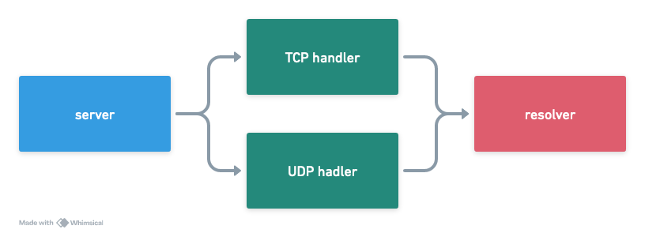

# DDOT

DDOT is a DNS server proxy to convert TCP/UDP query to DNS-over-TLS.

Main features:
- [x] Support TCP connection
- [x] Support UDP connection
- [x] Support A record
- [x] Support AAAA record
- [ ] Support CNAME record
- [ ] Support NS record
- [ ] Support MX record
- [ ] Support TXT record
- [ ] Support SOA record

## System Design
This proxy consist of three main component, proxy, handler, and resolver.


Diagram above is showing the dependencies between component.
`Server` is depend on `TCP hanlder` and `UDP handler`. `TCP handler` and `UDP handler` are depend on `resolver`.
`TCP handler` and `UDP handler` implemented contract that defined by `server`.
`resolver` also implemented contract defined by `TCP handler` and `UDP handler`.

By following this design, we are open to other opportunities to add other handler. For example, if we want to implement DNS-over-HTTPS,
then we just need to add `HTTP handler` that implement all `server`'s contract. `HTTP handler` also will be able to reuse
`resolver` just like other handlers did.

## How to use this in microservices-oriented and containerized architecture?
> Assumption: you run your workload in kubernetes cluster using CoreDNS.

With your kubernetes cluster already have CoreDNS installed, then the next thing we need to do is to combine CoreDNS with ddot.
First, we deploy ddot inside VM in the same subnet with the kubernetes worker node. Make sure we deploy more than one instance
to make it high available. The reason to use VM is that we want the ddot have static IP. This static IP needed for the CoreDNS configuration later.

Let's say ddot deployed `10.0.12.1`, `10.0.12.2`, and `10.0.12.3` and run on port 5533. Then we update the CoreDNS config file to
```Corefile
.:53 {
    [OMITTED_SECTION]
    forward . 10.0.12.1:5533 10.0.12.2:5533 10.0.12.3:5533 {
        force_tcp
    }
}
```
Please note that we need to specify `force_tcp` option to make sure CoreDNS will use TCP when calling ddot. As ddot is support TCP and UDP,
we can also utilize the UDP protocol by adding `prefer_udp`. By the nature of CoreDNS, when both options is set, TCP takes precedence and UDP
become the fallback.


## Installation
### Prerequisite
- Golang >= 1.22.1
- Docker

### Configuration
- Create `.env` or copy it from example file
  - `cp .env.example .env`
- Config file example
```env
HOST=0.0.0.0 #the proxy address
PORT=5533 #the proxy port
TARGET_SERVER_ADDRESS=1.1.1.1:853 #the DNS server target address
UDP_SERVER_ENABLED=true #toggle to enable or disable UDP connection
TCP_SERVER_TIMEOUT=120 #TCP timeout duration on seconds
```

## Run in local
```shell
make run-binary
```

## Run in container
```shell
make build-image
make run-container
```

## Query test
You can use your favorite DNS client. For this example, we will use [q](https://github.com/natesales/q). Make sure you had it installed in your machine.
### Query type A record using TCP
```shell
$ q google.com @tcp://127.0.0.1:5533 A -v
DEBU[0000] Name: google.com
DEBU[0000] RR types: [A]
DEBU[0000] Server(s): [tcp://0.0.0.0:5533]
DEBU[0000] Using server 0.0.0.0:5533 with transport tcp
DEBU[0000] Using TCP transport: 0.0.0.0:5533
google.com. 0s A 64.233.170.100
google.com. 0s A 64.233.170.101
google.com. 0s A 64.233.170.102
google.com. 0s A 64.233.170.113
google.com. 0s A 64.233.170.138
google.com. 0s A 64.233.170.139
```

### Query type AAAA record using UDP
```shell
$ q google.com --server 127.0.0.1:5533 AAAA -v
DEBU[0000] Name: google.com
DEBU[0000] RR types: [AAAA]
DEBU[0000] Server(s): [0.0.0.0:5533]
DEBU[0000] Using server 0.0.0.0:5533 with transport plain
DEBU[0000] Using UDP with TCP fallback: 0.0.0.0:5533
google.com. 0s AAAA 2404:6800:4003:c03::65
google.com. 0s AAAA 2404:6800:4003:c03::66
google.com. 0s AAAA 2404:6800:4003:c03::8a
google.com. 0s AAAA 2404:6800:4003:c03::8b
```
